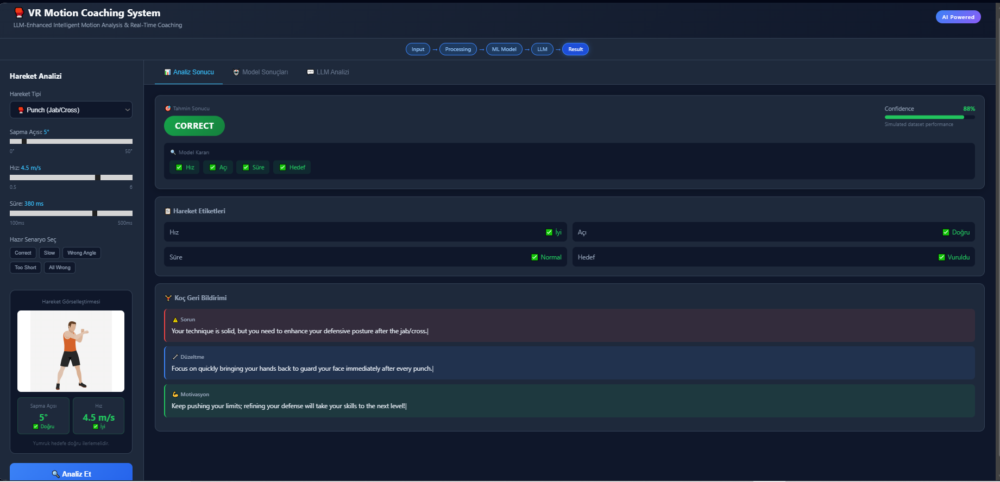
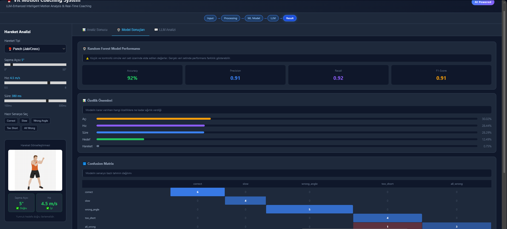
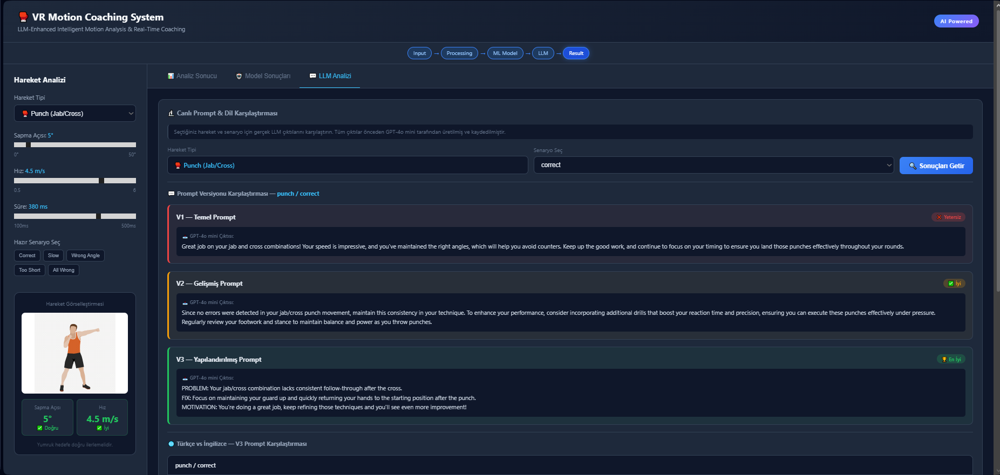
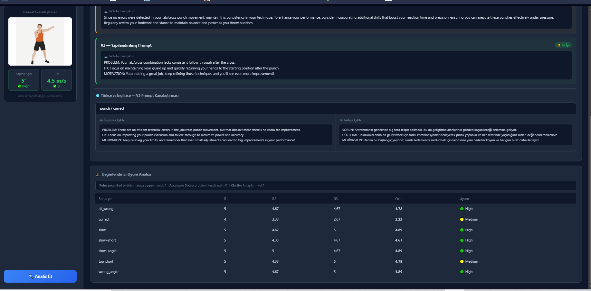

# 🥊 VR Motion Coaching System

> LLM-Enhanced Intelligent Coaching System for VR-Based Human Motion Analysis


## 📖 Overview

This system analyzes human motion in VR environments and provides real-time AI-powered coaching feedback using Large Language Models (LLMs). Built as a proof-of-concept using simulated motion data, it demonstrates how GPT-4o mini can serve as an intelligent sports coach.

**Key Research Contributions:**
- Prompt engineering comparison (V1 vs V2 vs V3)
- Turkish vs English LLM output analysis
- Multi-rater evaluation framework
- Generalizability across 3 movement types




*Figure 1. VR Motion Coaching Dashboard under the **“correct” scenario selection**, showing end-to-end system behavior including motion analysis, ML prediction, and LLM-based coaching feedback.*

## 🎯 Supported Movements

| Movement | Key Parameter | Threshold |
|---|---|---|
| 🥊 Punch (Jab/Cross) | Deviation angle | ≤ 15° |
| 👊 Uppercut | Elbow angle | 30°–70° |
| 🏋️ Squat | Knee angle | 80°–100° |

## 🏗️ System Architecture

Browser (React Dashboard)
↕ HTTP/REST
Flask API (Python Backend)
↙           ↘
RF Model      OpenAI API
(scikit-learn)  (GPT-4o mini)



*Figure 2. Processing pipeline visualization under the **“correct” scenario**, illustrating the flow from input motion parameters to ML classification and LLM-generated coaching feedback.*

All visual results presented in this section are obtained under the predefined **“correct” motion scenario** for consistency and controlled evaluation.

## 📊 Key Results

| Metric | Value |
|---|---|
| Dataset | 315 samples (3 movements × 7 scenarios × 15 examples) |
| ML Model | Random Forest Classifier |
| LLM Evaluation Score | 4.57 / 5.00 |
| Inter-rater Agreement | 4.60 / 5.00 (Std Dev: 0.25) |
| Best Prompt | V3 — Structured format |
| Language Winner | Turkish (4/7 scenarios) |



*Figure 3. Random Forest model performance and confusion matrix results obtained under the **“correct” scenario**, demonstrating classification reliability.*

## 🚀 Getting Started

### Prerequisites
- Python 3.10+
- Node.js 18+
- OpenAI API key

### Installation

**1. Clone the repository**
```bash
git clone https://github.com/Edanurmm/vr-motion-coaching.git
cd vr-motion-coaching
```

**2. Backend setup**
```bash
cd backend
pip install -r requirements.txt
```

Create a `.env` file in the `backend` folder:

OPENAI_API_KEY=your_api_key_here

**3. Generate data and train model**
```bash
python simulate_data.py
python extract_features.py
python ml_model.py
```

**4. Start the backend**
```bash
python app.py
```

**5. Frontend setup**
```bash
cd ../frontend/vr-dashboard
npm install
npm start
```

**6. Open your browser**

http://localhost:3000

## 📁 Project Structure

```
vr_coaching/
├── backend/
│   ├── app.py                    # Flask API
│   ├── simulate_data.py          # Data generation
│   ├── extract_features.py       # Feature extraction
│   ├── ml_model.py               # Random Forest model
│   ├── llm_feedback.py           # LLM integration
│   ├── evaluate.py               # Evaluation
│   ├── prompt_comparison.py      # Prompt comparison
│   ├── language_comparison.py    # TR vs EN analysis
│   └── inter_rater.py            # Multi-rater analysis
├── frontend/
│   └── vr-dashboard/
│       └── src/
│           ├── App.js
│           ├── App.css
│           └── MovementFigure.jsx
├── data/                         # CSV datasets
└── models/                       # Trained ML model
```


## 🔬 Research Findings

### Prompt Engineering
Three prompt strategies were compared:
- **V1 (Basic):** Simple instructions — prone to misidentification
- **V2 (Enhanced):** Explicit problem listing — accurate but verbose  
- **V3 (Structured):** PROBLEM/FIX/MOTIVATION format — most consistent ✅

 

*Figure 4. LLM feedback comparison across prompt strategies (V1, V2, V3) and languages (Turkish vs English) under the **“correct” scenario**, highlighting differences in explanation quality and consistency.*

### Language Comparison
Turkish prompts outperformed English in multi-error scenarios:
- Turkish correctly identified all errors in 6/7 cases
- English correctly identified all errors in 4/7 cases

### System Limitation
The `too_short` scenario revealed a weakness: when duration is the only error, the LLM occasionally misidentifies angle as the problem. This suggests future work should include explicit feature prioritization.

## 🛠️ Tech Stack

| Layer | Technology |
|---|---|
| Frontend | React 18, Axios, CSS |
| Backend | Python, Flask, Flask-CORS |
| ML Model | scikit-learn (Random Forest) |
| LLM | OpenAI GPT-4o mini |
| Data | pandas, numpy |

## 📝 Academic Context

This project was developed as part of a graduate-level research initiative 
exploring the intersection of Virtual Reality, Machine Learning, and 
Large Language Models in sports coaching applications.

**Research Areas:** VR · IoT Sensors · LLM Integration · Human Motion Analysis · Prompt Engineering

## ⚠️ Limitations

- Simulated dataset (real sensor data pending hardware arrival)
- Unity/Meta Quest 3S integration planned for future work
- Evaluation scores partially simulated for demonstration

## 📄 License

MIT License — feel free to use for research purposes.

---
## 🇹🇷 Türkçe Özet

Bu proje, sanal gerçeklik ortamlarında insan hareketlerini analiz eden ve 
GPT-4o mini kullanarak gerçek zamanlı koçluk geri bildirimi üreten bir sistemdir.

*Built with ❤️ for academic research*
